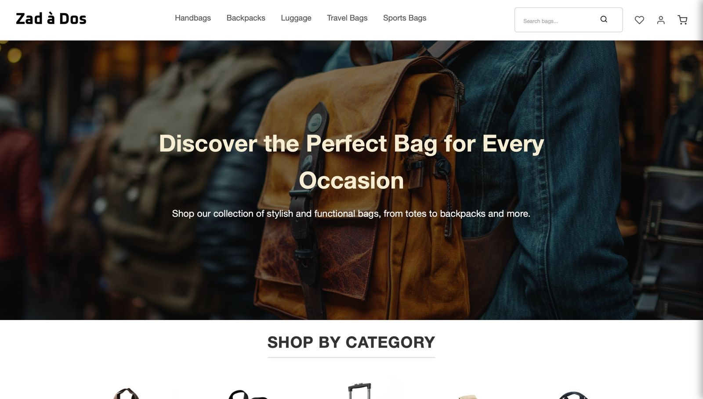
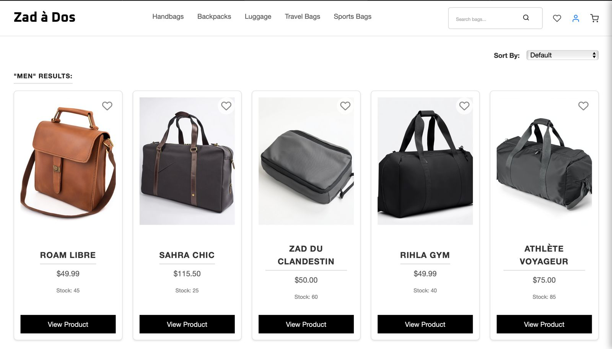
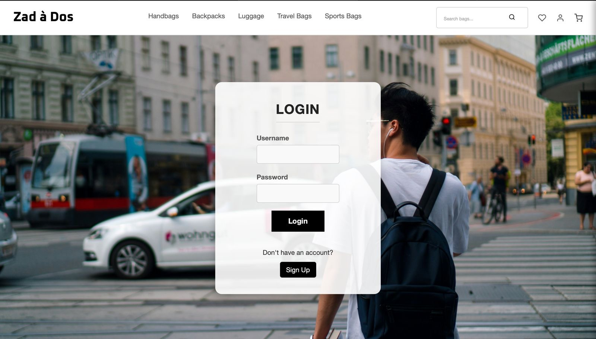
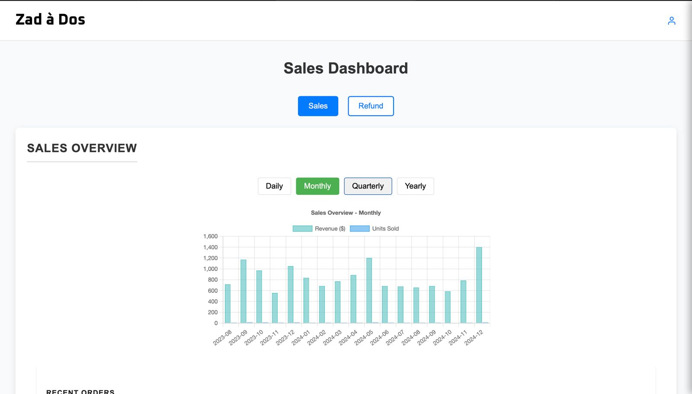

<div align="center">

# 🛍️ Zad à Dos - Modern E-commerce Platform

[](https://www.sabanciuniv.edu/en)
[](https://reactjs.org/)
[](https://expressjs.com/)
[](https://www.mysql.com/)

**Zad à Dos** is a modern, feature-rich e-commerce platform specialized in bag retail. Built with React.js and powered by Express.js & MySQL, it delivers a seamless shopping experience with enterprise-grade features.

[View Demo](https://your-demo-link.com) 

</div>

---

## ✨ Features

### For Customers
- 🏠 **Intuitive Home Page** - Showcase of featured products and trending categories [View Home Page](#home-page)
- 🔍 **Advanced Product Discovery** 
  - Smart filtering and sorting options [View Catalog](#product-listings)
  - Detailed product pages with high-resolution images [View Details](#product-details)
  - Real-time stock updates
- 🛒 **Seamless Shopping Experience**
  - Easy cart management [View Cart](#shopping-cart)
  - Wishlist functionality [View Wishlist](#wishlist)
  - Streamlined checkout process [View Checkout](#checkout)
- 👤 **User Management**
  - Secure authentication system [View Authentication](#authentication)
  - Personal profile customization
  - Order history tracking

### For Administrators
- 📊 **Comprehensive Dashboard**
  - Real-time sales analytics [View Sales Dashboard](#sales-dashboard)
  - Customer insights [View Customer Info](#customer-management)
  - Inventory management
- 🎯 **Product Management**
  - Bulk product upload [View Product Management](#product-management)
  - Category management
  - Price and stock updates
- 👥 **Customer Management**
  - Detailed customer profiles
  - Order tracking
  - Communication tools

---

## 🛠️ Tech Stack

- **Frontend:**
  - React.js

- **[Backend:](https://github.com/pishmish/laback).**
  - Express.js
  - MySQL
  - Node.js

---

## 🚀 Quick Start

### Prerequisites

```bash
node >= 16.x
npm >= 8.x
```

### Installation

1. Clone the repository
```bash
git clone https://github.com/yourusername/zad-a-dos.git
cd zad-a-dos
```

2. Install dependencies
```bash
npm install
```

3. Start the development server
```bash
npm start
```

🌐 Access the application at `http://localhost:3000`

---

## 📸 Screenshots

### Customer Interface

<details>
<summary>Click to expand</summary>

#### Home Page

*Engaging landing page with featured products and categories*

#### Product Listings

*Comprehensive product catalog with advanced filtering*

#### Product Details

*Detailed product information with high-resolution images*

#### Shopping Cart

*Intuitive cart management system*

#### Wishlist

*Personal wishlist for saved items*

#### Authentication

*Secure user login system*


*User-friendly registration process*

#### Checkout

*Streamlined checkout experience*
</details>

### Admin Interface

<details>
<summary>Click to expand</summary>

#### Sales Dashboard

*Comprehensive sales analytics and reporting*

#### Product Management

*Advanced product management interface*

#### Customer Management

*Detailed customer insights and management*
</details>

---

## 📁 Project Structure

```
src/
├── assets/         # Static resources
├── components/     # Reusable UI components
├── pages/          # Page components
├── services/       # API integrations
├── styles/        # Global styles
└── App.js         # Main component
```

---
## 🤝 Contributing

## 👥 Team

Meet the talented developers behind Zad à Dos:

- Nuh Al-Sharafi 
- Musab Ahmed Khan 
- Guanghui Ma 
- Muhammad Haris 
- Areeb Kamal 
- Cem Görkem Baysal

## We welcome contributions! Please follow these steps:

1. Fork the repository
2. Create your feature branch (`git checkout -b feature/AmazingFeature`)
3. Commit your changes (`git commit -m 'Add some AmazingFeature'`)
4. Push to the branch (`git push origin feature/AmazingFeature`)
5. Open a Pull Request

## 📄 License

This project is licensed under the Sabancı University.

## 🙏 Acknowledgments

- Special thanks to Sabanci University for the project opportunity
- All contributors who have helped shape Zad à Dos
- The open-source community for their invaluable resources

---
<div align="center">
Made with ❤️ by the Zad à Dos Team
</div>
